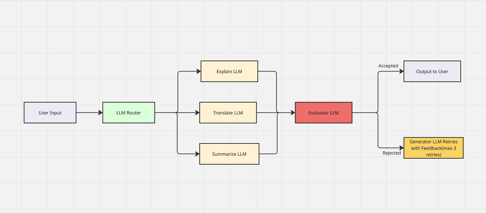

# LLM Router Evaluator

An intelligent LLM-based router system that automatically classifies user requests and routes them to appropriate task handlers (Explain, Translate, Summarize) with built-in evaluation and feedback loops.

## Features

- **Smart Routing**: Uses DSPy to automatically classify user requests into supported tasks
- **Multiple Task Support**: 
  - **Explain**: Provides clear explanations for concepts and topics
  - **Translate**: Translates English text to German
  - **Summarize**: Creates concise summaries of text
- **Intelligent Evaluation**: Built-in evaluator assesses response quality and provides feedback
- **Iterative Improvement**: Up to 3 attempts with feedback-driven refinement
- **Robust Error Handling**: Gracefully handles requests that don't fit supported categories

## Technology Stack

- **DSPy**: Modern framework for LLM programming with structured prompts
- **Anthropic Claude**: High-quality language model via LiteLLM integration
- **Gradio**: Web interface for easy interaction and public hosting
- **Python 3.11+**: Modern Python with type hints

## Setup

1. **Clone the Repository**:
   ```bash
   git clone <repository-url>
   cd llm-router-evaluator
   ```

2. **Install Dependencies**:
   ```bash
   pip install -r requirements.txt
   ```

3. **Environment Configuration**:
   Create a `.env` file with your Anthropic API key:
   ```bash
   ANTHROPIC_API_KEY=your_api_key_here
   ```

## Running the Application

### Command Line Interface
```bash
python main.py
```

### Web Interface (Gradio)
```bash
python app.py
```
This will launch a web interface at `http://localhost:7860` with a public sharing link for temporary access.

### Local Development with Virtual Environment
```bash
# Activate virtual environment (if using one)
source llm-router-venv/bin/activate

# Run CLI version
python main.py

# Run web interface
python app.py
```

## Usage Examples

### Explanation Request
```
Input: "Please explain quantum computing"
Output: Detailed explanation of quantum computing concepts
```

### Translation Request
```
Input: "Translate: How are you today?"
Output: German translation of the text
```

### Summarization Request
```
Input: "Summarize this text: [long text content]"
Output: Concise summary preserving key information
```

### Invalid Request Handling
```
Input: "How are you doing today?"
Output: "Sorry, your request doesn't fit our supported tasks (Explain, Translate, Summarize). Please rephrase your request."
```

## Architecture



### DSPy Integration
The system leverages DSPy's structured approach to LLM programming:

- **Signatures**: Define input/output schemas for each task
- **Modules**: Encapsulate LLM functionality with clear interfaces  
- **Automatic Prompt Generation**: DSPy handles prompt engineering internally

### Core Components

1. **TaskRouter**: Classifies requests into Explain/Translate/Summarize/None
2. **Task Modules**: Specialized handlers for each supported task type
3. **EvaluateTask**: Assesses response quality and task completion accuracy
4. **Feedback Loop**: Iterative improvement based on evaluator feedback

### Evaluation System
- Validates that responses actually perform the requested task
- Provides detailed feedback for improvement
- Supports up to 3 refinement attempts
- Uses DSPy signatures for structured evaluation results

## Hosting on Hugging Face Spaces

For permanent public hosting, deploy to Hugging Face Spaces:

### 1. Create a Hugging Face Account & Space
1. Sign up at [huggingface.co](https://huggingface.co)
2. Go to [huggingface.co/spaces](https://huggingface.co/spaces)
3. Click "Create new Space"
4. Configure:
   - **Name**: `llm-router-dspy` (or your preferred name)
   - **SDK**: Gradio
   - **Hardware**: CPU (free tier)
   - **Visibility**: Public

### 2. Upload Files
Upload these files to your Space:
- `app.py` (main Gradio application)
- `router.py` (core LLM logic)
- `requirements.txt` (dependencies)
- `README.md` (optional documentation)

### 3. Set Environment Variables
In your Space settings:
1. Go to **Settings** → **Variables and secrets**
2. Add a new secret:
   - **Name**: `ANTHROPIC_API_KEY`
   - **Value**: Your actual Anthropic API key

### 4. Deploy
- Hugging Face Spaces will automatically install dependencies and deploy
- Your app will be live at: `https://your-username-space-name.hf.space`


## Project Structure

```
├── router.py            # Core LLM router logic and DSPy signatures
├── main.py              # Command-line interface
├── app.py               # Gradio web interface
├── requirements.txt     # Python dependencies
├── .env                 # Environment variables (API keys) - not tracked in git
├── .env.example         # Environment variables template
├── image/               # Flow diagram and assets
│   └── FlowDiagram.png
└── README.md           # This file
```

## Development

The project uses DSPy's declarative approach, eliminating manual prompt engineering:

- **Before**: Manual prompt strings and response parsing
- **After**: Structured signatures with automatic prompt generation
- **Benefits**: More maintainable, robust, and easier to extend

## Requirements

- Python 3.11+
- Anthropic API key
- Dependencies listed in requirements or installed via pip
